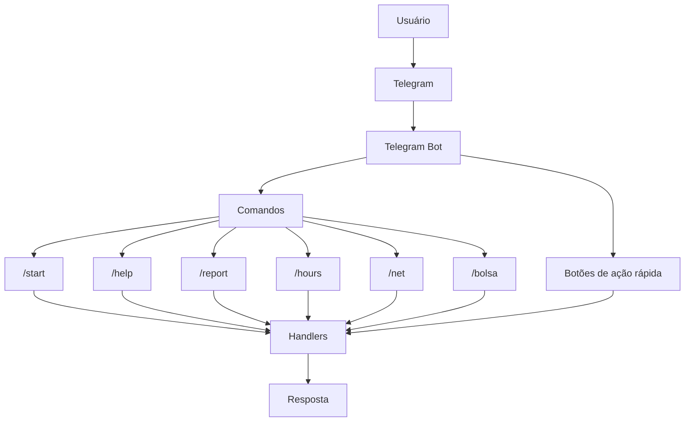

# 🤖 Telegram Bot

<p align="center">
  
  
  
  
  
</p>

Bot para Telegram desenvolvido em **Python 3.14**, utilizando a biblioteca [`python-telegram-bot`](https://github.com/python-telegram-bot/python-telegram-bot).

O projeto foi desenvolvido com foco em estudo e prática de desenvolvimento de bots para Telegram, oferecendo comandos e botões de ação rápida para facilitar a interação com os usuários.

---

## 🛠️ Tecnologias

| Tecnologia | Badge |
|---|---|
| Python |  |
| python-telegram-bot |  |
| python-dotenv |  |
| HTTPX |  |
| Docker |  |

---

## 📁 Estrutura do projeto

```
meu-bot/
├── handlers/
│   ├── talk.py
│   └── botoes.py
├── main.py
├── requirements.txt
├── Dockerfile
├── .dockerignore
├── .env
└── README.md
```

### Principais arquivos

| Arquivo | Descrição |
|---|---|
| `main.py` | Ponto de entrada da aplicação |
| `handlers/talk.py` | Handlers relacionados às interações e comandos |
| `handlers/botoes.py` | Botões e ações rápidas do bot |
| `requirements.txt` | Dependências do projeto |
| `Dockerfile` | Configuração para execução com Docker |
| `.dockerignore` | Arquivos ignorados durante o build da imagem |
| `.env` | Variáveis de ambiente |
| `README.md` | Documentação do projeto |

---

## ⚙️ Configuração

**1. Clone o repositório**
```bash
git clone SEU_REPOSITORIO
cd meu-bot
```

**2. Crie um ambiente virtual**
```bash
python -m venv .venv
```

**3. Ative o ambiente virtual**

Windows:
```bash
.venv\Scripts\activate
```

Linux/macOS:
```bash
source .venv/bin/activate
```

**4. Instale as dependências**
```bash
pip install -r requirements.txt
```

---

## 🔐 Variáveis de ambiente

Crie um arquivo `.env` na raiz do projeto:

```env
TELEGRAM_TOKEN_API=SEU_TOKEN_AQUI
```

O token do bot pode ser obtido através do [@BotFather](https://t.me/BotFather) no Telegram.

> ⚠️ **Importante:** nunca compartilhe ou publique o token do seu bot. Evite também versionar o arquivo `.env` no Git.

Recomenda-se adicionar o `.env` ao `.gitignore`:

```gitignore
.env
.venv/
__pycache__/
*.pyc
```

---

## ▶️ Executando localmente

Com o ambiente virtual ativado, execute:

```bash
python main.py
```

Se tudo estiver configurado corretamente, o bot será iniciado e começará a receber atualizações do Telegram.

---

## 🐳 Executando com Docker

**Construindo a imagem**
```bash
docker build -t meu-bot .
```

**Executando o container**
```bash
docker run --env-file .env meu-bot
```

**Docker Compose**

Caso o projeto possua um arquivo `compose.yml` ou `docker-compose.yml`, execute:

```bash
docker compose up -d
```

Para acompanhar os logs:
```bash
docker compose logs -f
```

Para parar os containers:
```bash
docker compose down
```

---

## 📌 Comandos disponíveis

| Comando | Descrição |
|---|---|
| `/start` | Inicia a interação com o bot |
| `/help` | Exibe informações de ajuda |
| `/report` | Acessa a funcionalidade de relatórios |
| `/hours` | Consulta informações de horários |
| `/net` | Acessa funcionalidades relacionadas à rede |
| `/bolsa` | Acessa informações relacionadas à bolsa |

💡 Além dos comandos, o bot também possui um teclado com ações rápidas, permitindo acessar algumas funcionalidades diretamente pelos botões.

---

## 🔄 Fluxo básico



---

## 🚧 Status do projeto

**Em desenvolvimento** 🚀

O projeto está em constante evolução. Novas funcionalidades, comandos e melhorias serão adicionados conforme o desenvolvimento avançar.

---

## 🗺️ Próximos passos

- [ ] Adicionar novos comandos
- [ ] Melhorar os teclados e menus
- [ ] Adicionar tratamento de erros
- [ ] Implementar logs estruturados
- [ ] Melhorar a documentação
- [ ] Adicionar testes automatizados
- [ ] Melhorar o suporte via Docker
- [ ] Configurar CI/CD

---

## 👨‍💻 Desenvolvimento

Desenvolvido em **Python 3.14**.

Este projeto foi criado com o objetivo de estudar e desenvolver aplicações integradas ao Telegram, explorando conceitos como:

- Desenvolvimento de bots
- Handlers e comandos
- Botões e teclados interativos
- Variáveis de ambiente
- APIs HTTP
- Docker e containerização

---

## 📄 Licença

Este projeto ainda não possui uma licença definida.

Caso o projeto seja disponibilizado publicamente, recomenda-se adicionar uma licença, como [MIT](https://choosealicense.com/licenses/mit/), conforme a necessidade do projeto.
